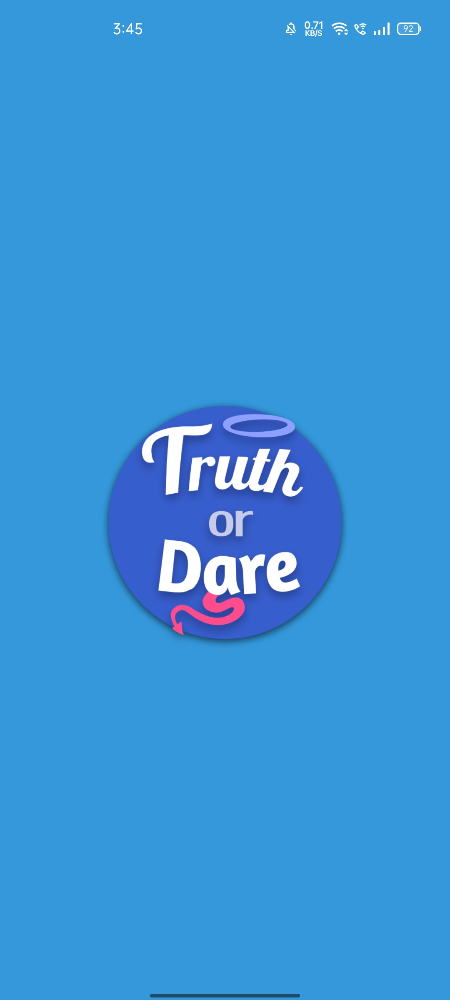
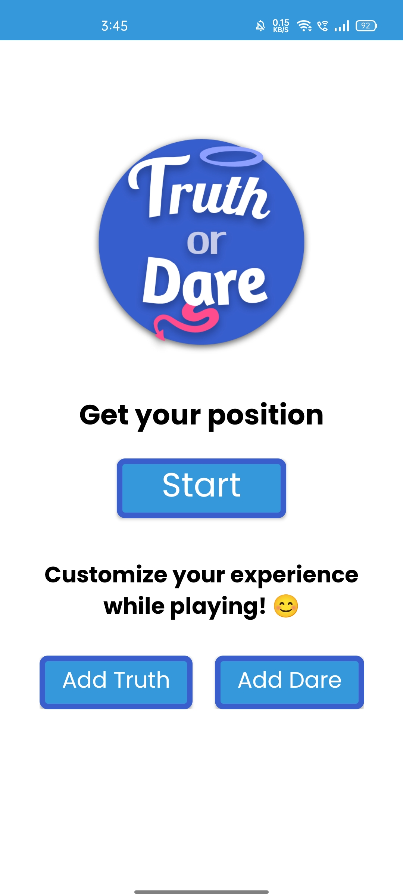
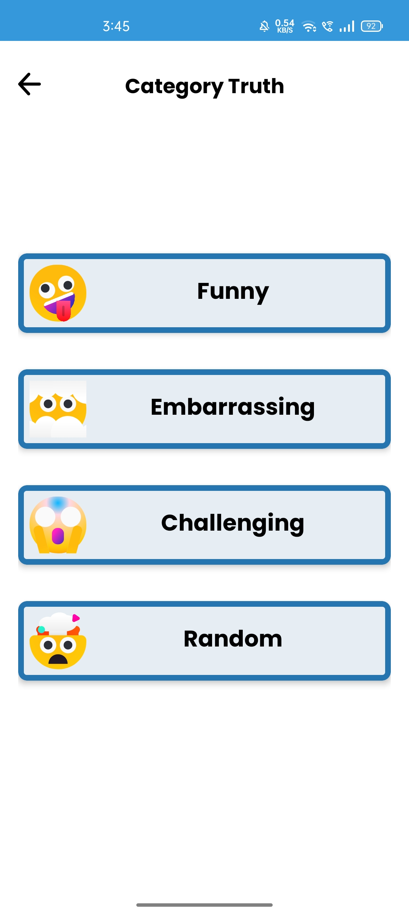
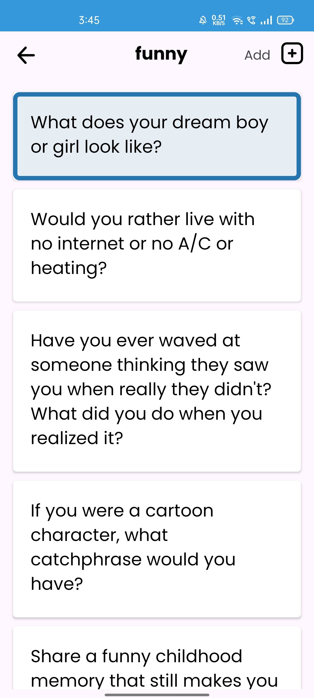
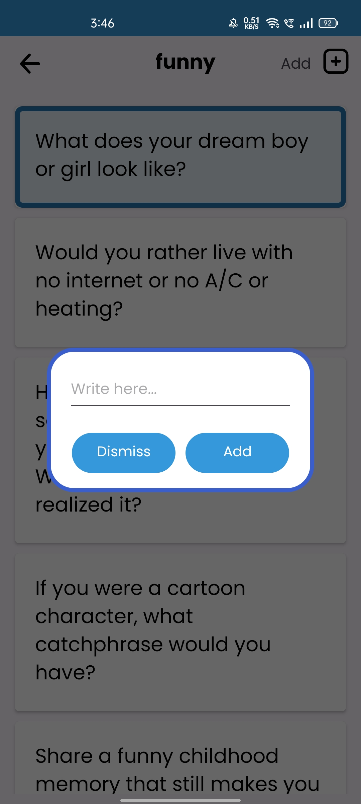
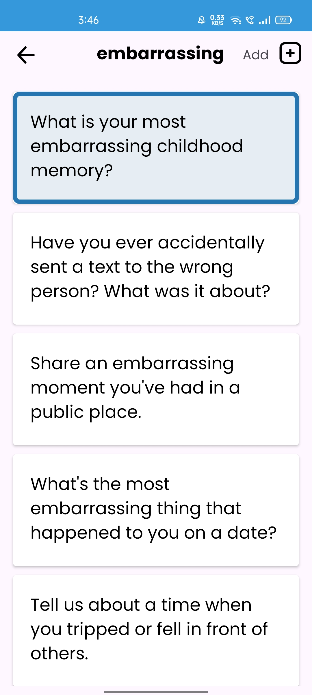
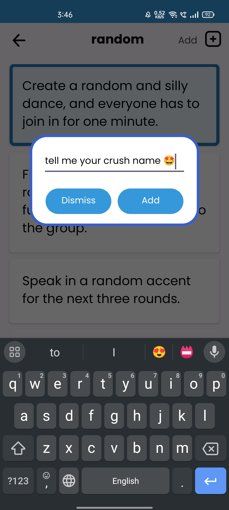
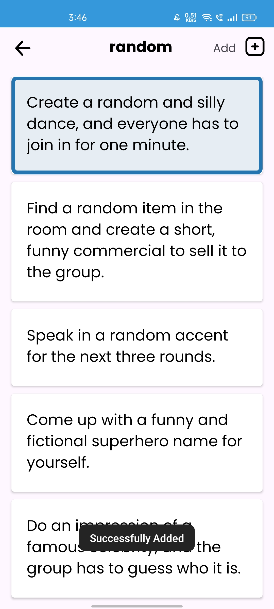
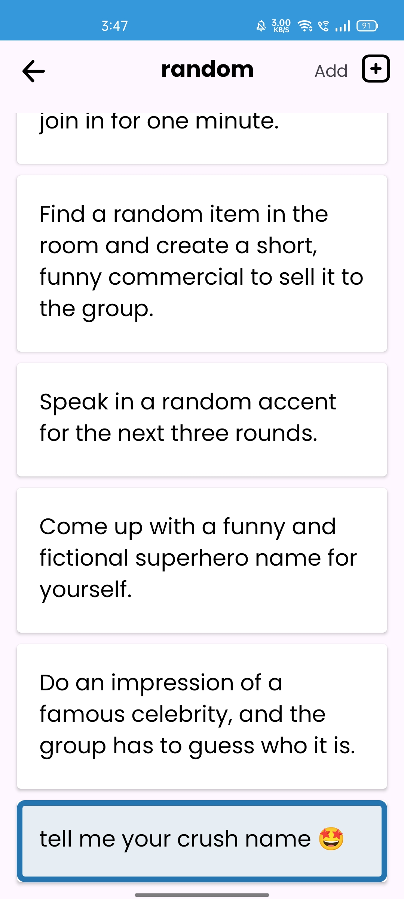

  

### Truth And Dare Game

 Dive into spontaneous fun with the Truth And Dare Game app! Spin the virtual bottle with captivating animations, unleashing creativity through hilarious truths and daring challenges. Customize the game with your own twists, challenge friends, and create lasting memories. Get ready for laughter, surprises, and endless entertainment in this lighthearted app!
 

---

# Truth And Dare Game
An Android App for Spontaneous Fun and Building Friendships

## **Why we created this App**

Ever felt bored during college or on the go? That's exactly why we created the Truth And Dare Game app – to turn dull moments into laughter-packed adventures! It's not just a game; it's your secret weapon for fun times with friends. Dive into hilarious truths and dares that'll have you sharing stories, revealing quirks, and making memories that stick. Perfect for rainy dorm days, road trips, beach hangs, or whenever you need a good laugh. It's time to add some excitement to the ordinary – let the Truth And Dare Game do the trick

## **Video-Demo**

<video width="200" height="433" controls>
  <source src="./assets/images/demo-app.mp4" type="video/mp4">
</video>
## **Screenshots**

      
   
   

## **Functionality & Concepts used**

The Truth And Dare Game app boasts a straightforward and engaging design, making it easy for users to add, explore, and enjoy customized truth and dare challenges. The app incorporates various Android concepts to deliver a seamless user experience:

- `Constraint Layout` : All of the activities in the app uses a flexible <b>Constraint Layout</b>, which is easy to handle for different screen sizes.
- `Recyclerview` :  To present the list of different notes and important notes we used the efficient <b>Recyclerview</b>. 
- `Shared-Preferences:` : Utilized SharedPreferences to store user data, enabling users to access their added truth or dare challenges whenever the app is launched.
- `ArrayList` : Implemented ArrayList to manage and store data related to truth and dare challenges, facilitating smooth organization and retrieval.
- `Navigation Component` : We are also using the <b>Navigation component</b> to switch pages/destination within the app.
- `Dialog` : A custom dialog is used to add truth or dare challenges, providing users with a personalized and user-friendly experience.
- `Rotation class:`  The app incorporates a rotation class in Android to enable interactive object rotation, enhancing the overall user interface.

## **Future Scope**

- `Firebase Integration` : Implement Firebase for secure authentication, allowing users to have personalized profiles, track their game history, and engage in a broader community.

- `Login and Registration` : Introduce a user login and registration system for a more personalized experience. Users can save their preferences, track their achievements,

- `Enhanced UI/UX` : Refine the user interface for a more intuitive and visually appealing experience. Incorporate animations and graphics to make the game more engaging.

- `Multiplayer Mode`: Introduce a multiplayer mode where users can connect with friends or random players for a more interactive and social gaming experience.

## **Application Link**

The app is currently in the Alpha testing phase limited no. of users. You can access the app by cloning the repo and building it on Android Studio.
Also we welcome, anyone who has an idea or wants to contribute to the project.

### Thank You!! :)
